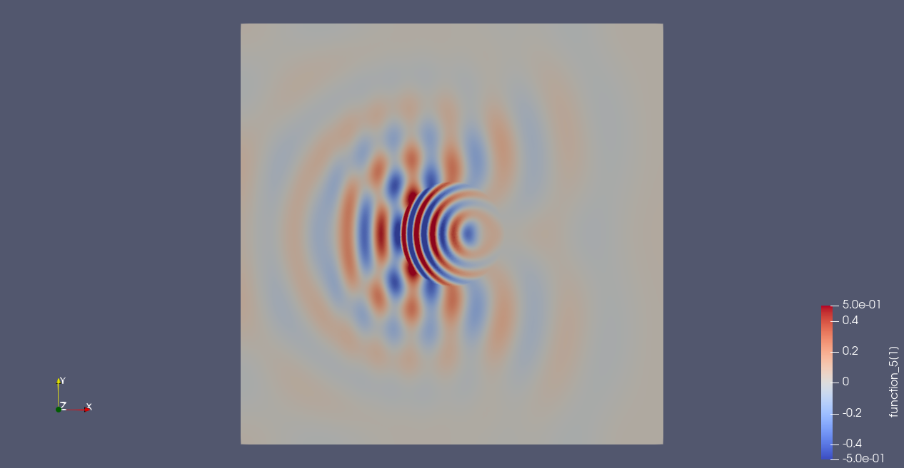
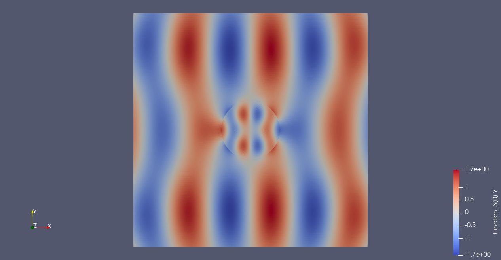

# maxwell-wave
Some simple wave propagation algorithms implemented in Firedrake

Script maxwell-wave.py propagates an electromagnetic wave in a periodic square domain - based on algorithm supplied by James Cook.

Script ed-wave.py again propagates an electromagnetic wave pulse $(B_z, E_x, E_y)$ polarization in a plane containing a circular dielectric scatterer.  Simple boundary conditions (homog Dirichlet or Neumann) apply at the edges of the domain (implement a perfect matched layer if want to allow waves to escape from domain and not come back).  Note as implemented the vector element stores the $E$ field and there are two nice choices of finite-elements (RTE and BDM, see the script) which work nicely because $E_{\parallel}$ is continuous at dielectric boundary whereas $E_{\perp}$ isn't ($D_{\perp}$ is!).

Script ed-wave-elliptic.py solves the Helmholtz problem for an incident plane wave (same polarization as above) in the same scatterer.  Boundary conditions appropriate to a plane wave are applied weakly - this does not give the usual Mie scattering solution for a pure plane wave at infinity (which latter could be calculated but I think it may require the complex branch of Firedrake and in any case it's a bit fiddly ...).  Turn the dielectric constant of the scatterer (circle_eps) to unity to see plane waves, but beware choosing a wavenumber $k$ corresponding to a harmonic!

